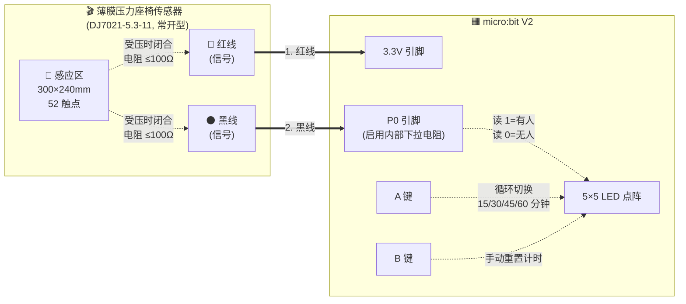
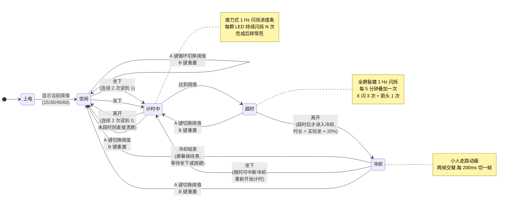

# 座椅传感器 × micro:bit 久坐提醒器

利用**汽车级薄膜压力座椅传感器**（DJ7021-5.3-11 接口）配合 micro:bit V2，检测是否有人坐在座椅上，超过设定时间后通过 LED 提醒起身活动。

---

## 工作原理

- 传感器本质上是一个**常开（NO）开关**：
  - 没人坐 → 触点断开，电阻无穷大
  - 有人坐 → 触点闭合，电阻 ≤100Ω
- 利用 micro:bit P0 的**内部下拉电阻**（无需外接元件），把传感器当成"按键"：
  - 没人坐 → P0 读到 0
  - 有人坐 → P0 读到 1
- 倒计时到设定阈值后，全屏骷髅 1 Hz 持续闪烁，每 5 分钟再叠加一次大叉 X + 箭头强提醒。
- 超时后用户站起来，会显示小人走路动画 5 分钟，冷却结束后黑屏等待用户按 A 键切换阈值。
- 短暂离开(未超时)直接清屏，不进入冷却流程。

---

## 硬件清单

| 物料 | 数量 | 备注 |
|------|------|------|
| micro:bit V1 / V2 | 1 | V2 自带蜂鸣器，V1 也能用 |
| 薄膜压力座椅传感器 | 1 | 300×240mm，52 触点，DJ7021-5.3-11 接口 |
| USB 数据线 / 电池盒 | 1 | 供电用 |
| 鳄鱼夹或杜邦线 | 2 根 | 传感器到 micro:bit 接线 |

> **BOM 成本：0 元**（全部用现有硬件，无需电阻 / 扩展板 / 蜂鸣器）

---

## 接线

### 接线示意



### 物理接线一览

```
电源
   ├── USB / 电池盒 (+3.3V)
   │       │
   │       ▼
   │   ┌─── ① 红线 ── 传感器 NO 触点 ── ② 黑线 ── P0 (内部下拉) ── GND (内部)
   │   │
   │   └── 无极性:若 P0 一直读到 0,把两根线对调
   ▼
micro:bit 3.3V
```

```
      ┌──────────────────────────────┐
      │        micro:bit V2          │
      │                              │
      │  3.3V ●───────── 传感红红线  │
      │                              │
      │   P0  ●───────── 传感黑黑线  │
      │                              │
      │   A ●   ● B  ← 按键          │
      │                              │
      │   5×5 LED  ← 显示状态        │
      └──────────────────────────────┘
```

### 关键说明

| 项 | 详情 |
|----|------|
| 接线数量 | 仅 2 根线（红 + 黑） |
| 所需外接元件 | **无**（用 P0 内部下拉电阻） |
| 极性 | **无**——两根线可对调，若 P0 一直读到 0 则反过来接 |
| 接口处理 | DJ7021-5.3-11 汽车插头可剪掉，露出线芯接鳄鱼夹或杜邦线（剥皮 5mm 镀锡） |
| 传感器安装 | 蒙皮与海绵之间（参考产品说明书图示） |

```
      座椅剖面图（侧面）

        ┌─────┐
        │蒙皮 │ ← 皮革/布料面
        ├─────┤
        │传感 │ ← 传感器垫在这里
        │器片 │    (300×240mm 感应区)
        ├─────┤
        │海绵 │ ← 缓冲层
        └─────┘
        ══════  座椅底板
```

---

## 烧录步骤

1. **用 USB 数据线**把 micro:bit 连接到电脑。
2. 打开 [https://python.microbit.org](https://python.microbit.org) 在线编辑器，或使用本地 **Mu** / **Thonny**。
3. 把 `main.py` 的内容全部粘贴进去。
4. 点击 **Flash** 烧录（在线编辑器）或 **刷入**（本地工具）。
5. 烧录完成后，micro:bit 会显示一个 ✓，然后滚动显示当前阈值（默认 45）。
6. 拔掉 USB，接上电池盒，把传感器垫在座椅的蒙皮与海绵之间。

---

## 按键操作

| 按键 | 功能 |
|------|------|
| **A 键** | 循环切换久坐阈值：**15 / 30 / 45 / 60 分钟**（LED 滚动显示新数值）；切换时会清空当前计时与进度条 |
| **B 键** | 立即重置久坐计时（短暂离开后回到座位时使用）。按下后先显示笑脸 0.5 秒,然后滚动显示当前挡位(15/30/45/60),最后清屏 |
| **A + B 同时** | 不需要操作；上电自动启动 |

---

## 状态显示

### 状态机



**节点含义**:

| 节点 | 屏幕 | 触发进入 |
|------|------|----------|
| **上电** | ✓ → 滚动显示当前阈值 | 上电启动 |
| **空闲** | 灭 | 无人坐 |
| **计时中** | 接力式 1 Hz 闪烁进度条 | 坐下 |
| **超时** | 全屏骷髅 1 Hz 闪烁(无限期) | 达到阈值 |
| **冷却** | 小人走路动画(时长 = 实际坐的时长 × 20%) | 超时后站起来 |

**A 键 / B 键**:在任意状态下都立即生效(切换阈值或完全重置),状态机图中用独立的"任意→空闲"转移表示。

### 进度条规则(接力式均匀闪烁)

- **总时长分配**:阈值时间(毫秒) = 15/30/45/60 分钟 × 60 × 1000 = 900000/1800000/2700000/3600000 ms,平均分配给 25 颗 LED
- **每颗 LED 分到的工作时长 = 总毫秒数 / 25**:
  - 15 分钟阈值:每颗 **36000 ms**(36 秒)
  - 30 分钟阈值:每颗 **72000 ms**(72 秒)
  - 45 分钟阈值:每颗 **108000 ms**(108 秒)
  - 60 分钟阈值:每颗 **144000 ms**(144 秒)
- **每颗 LED 在自己的时段内持续 1 Hz 满亮闪烁**(亮 0.5s / 灭 0.5s),**闪烁次数 = 工作时长 / 1000**:
  - 15 分钟阈值:每颗闪 **36 次**
  - 30 分钟阈值:每颗闪 **72 次**
  - 45 分钟阈值:每颗闪 **108 次**
  - 60 分钟阈值:每颗闪 **144 次**
- **闪烁结束立刻转常亮**,作为累计进度;已完成的 LED 在后续时段中保持常亮
- **填充方向**:从下往上、每行从左到右(LED_FILL_ORDER)
- **任意时刻屏幕状态**:**已亮的 LED 形成"已坐"区域**(自下而上铺),**当前在闪的 LED 是"分界线"**,**未亮的 LED 是"剩余"区域**
  - 剩余百分比 ≈ `(25 − 常亮数) / 25 × 100%`(减去当前在闪的那颗)
- **总时长结束**:全部 25 颗常亮,进入超时分支

这样设计的好处:
- **能量均匀分配**:每颗 LED 都闪同样的次数,总闪烁次数 = 总秒数
- **进度感强**:常亮 LED 数 / 25 = 进度百分比,一眼可读
- **秒级时间感**:当前在闪的 LED 是分界线,在它专属的几十秒内持续 1 Hz 闪烁,你能直观感受"还在这一段"

### 超时与冷却流程

超时后按以下顺序处理,**仅在用户真正超时后才进入冷却**:

1. **大叉提醒叠加**(每 5 分钟一次):大叉 X 闪 3 次 + 箭头 1 次,完整闪完不被持续动画打断
2. **持续骷髅闪烁**:`Image.SKULL` 1 Hz 闪烁(亮 0.5s / 灭 0.5s),直到用户站起来
3. **用户站起来 → 走路动画冷却(时长 = 实际坐的总时长 × 20%)**:`Image.STICKFIGURE` + 自定义第二帧交替(每 200ms 切一帧),模拟迈步。例如阈值 45 分钟准时站起 → 冷却 9 分钟;坐满 60 分钟才起 → 冷却 12 分钟
4. **冷却结束 → 黑屏等待**:屏幕保持黑,等待用户按 A 键切换阈值或再次坐下
5. **任意时刻按 A/B 键**:A 键循环切换 15/30/45/60 阈值并滚动显示;B 键重置所有状态(显示笑脸)

> **注意**:未超时就短暂离开(例如伸懒腰几秒又坐下),不会进入走路动画冷却流程,直接清屏等待用户回来。

### 显示总表

| 状态 | LED 显示 |
|------|---------|
| 上电启动 | ✓ → 滚动显示当前阈值(15/30/45/60) |
| 无人坐(未超时) | 灭,等待用户回来 |
| 有人坐、计时中 | 接力式均匀闪烁进度条:任意时刻 1 颗 LED 1 Hz 闪烁(亮 0.5s / 灭 0.5s),其余 LED 中已完成的常亮、未开始的灭 |
| 刚达到阈值 | X 闪 3 次 + 箭头 1 次 + 持续全屏骷髅闪烁(1 Hz) |
| 每 5 分钟叠加提醒 | 大叉 (X) 闪 3 次 + 站立箭头(期间暂停骷髅闪烁,X 完整闪完) |
| 超时后站起来 | 小人走路动画冷却(时长 = 实际坐的总时长 × 20%,默认 20%,`STICKFIGURE` + 自定义帧交替) |
| 冷却 5 分钟后 | 黑屏,等待用户按 A 键切换阈值或坐下 |
| A 键切换阈值 | 滚动显示新阈值,清空当前计时与冷却 |
| B 键手动重置 | 笑脸 0.5 秒 + 滚动显示当前挡位(15/30/45/60),清空当前计时与冷却 |

---

## 调试 / 故障排查

| 现象 | 可能原因 | 解决办法 |
|------|---------|---------|
| LED 一直接收不到 P0 信号（一直读到 0） | 传感器两根线接反 | 把红/黑线对调 |
| LED 一直显示"有人"（一直读到 1） | 3.3V 短路 / 传感器线破皮搭铁 | 用万用表测传感器两端电阻：空载 >1MΩ，坐上 <100Ω |
| 坐下/起立时 LED 频繁误触发 | 抖动 | 调大 `main.py` 中 `DEBOUNCE_COUNT`（如改为 3 或 5） |
| 坐 1 小时也不提醒 | `running_time()` 在 micro:bit 上以毫秒返回；或阈值档位选错 | 按 A 键确认当前阈值；用 REPL 看 `print(running_time())` |
| 闪烁节奏不合适 | 1 Hz 太快/太慢 | 编辑 `main.py` 中 `draw_progress()` 里的 `// 500`(改大 = 闪烁更慢,改小 = 闪烁更快);但请保持 SAMPLE_MS=100(10 Hz 主循环),否则高频闪烁会因采样不足看不见 |
| 想临时测 1 分钟就提醒 | 改阈值 | 编辑 `THRESHOLDS = [1, 2, 5]` 测试，确认无问题后改回 15/30/45/60 |

**实时调试小贴士**：在 `while True` 开头加一行 `print("P0=", pin0.read_digital())`，然后用 Mu 的 **REPL** 或 Thonny 的串口监视器，可实时看到 P0 在有人/无人时的读数变化。

---

## 文件结构

```
sitdetecter/
├── main.py                       # 主程序（烧录到 micro:bit）
├── README.md                     # 本文件
├── 座椅传感器产品参数表.jpg       # 传感器规格
└── 座椅传感器产品使用和说明.jpg   # 安装位置示意
```

---

## 进阶玩法（不在本次范围）

- 改用 P0 模拟读取 + 10kΩ 外部分压电阻，区分"轻坐 / 重坐"，给"跷二郎腿"等动作单独提醒。
- 多个座椅 + micro:bit 无线电模块，组网监测办公室哪些位置久坐。
- 倒计时改为每 45 分钟提醒，并累计今日总久坐时长。
- 配合 micro:bit 板载加速度计，贴在椅背做"坐姿检测"。