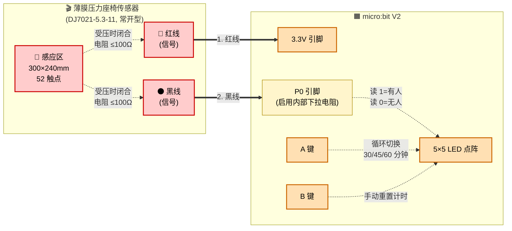
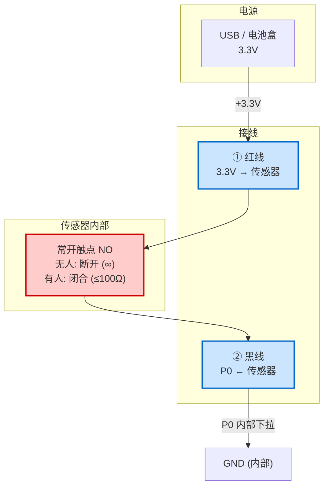
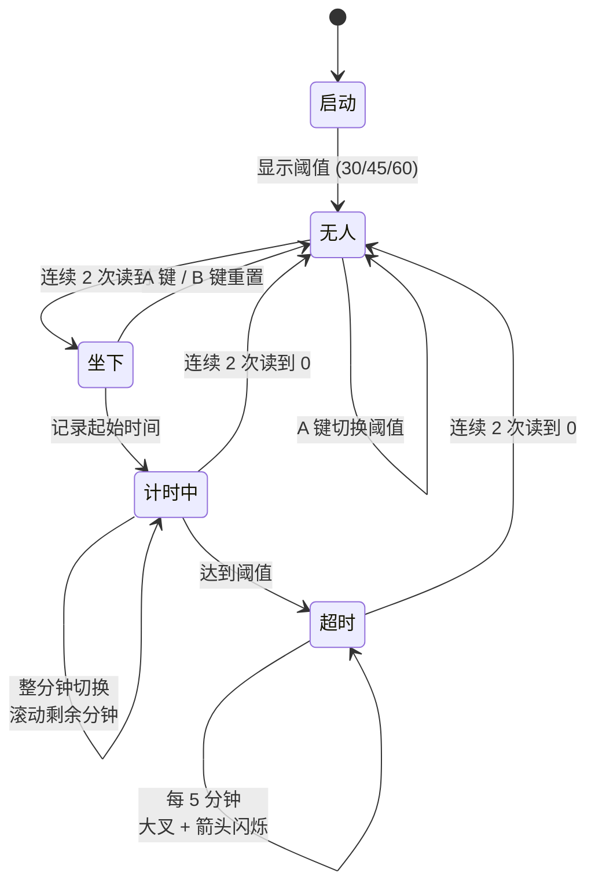

# 座椅传感器 × micro:bit 硬件连线示意图

下面这张图用 mermaid 描述了 micro:bit V2 与薄膜压力座椅传感器之间的接线关系。可以用 VS Code / Typora / GitHub 等支持 mermaid 的编辑器直接预览。

## 接线示意图



## 物理接线一览



## 状态机时序



## 关键说明

| 项 | 详情 |
|----|------|
| 接线数量 | 仅 2 根线（红 + 黑） |
| 所需外接元件 | **无**（用 P0 内部下拉电阻） |
| 极性 | **无**——两根线可对调，若 P0 一直读到 0 则反过来接 |
| 接口处理 | DJ7021-5.3-11 汽车插头可剪掉，露出线芯接鳄鱼夹或杜邦线 |
| 传感器安装 | 蒙皮与海绵之间（参考产品说明书图示） |

## 实物摆放参考

```
      座椅剖面图（侧面）

        ┌─────┐
        │蒙皮 │ ← 皮革/布料面
        ├─────┤
        │传感 │ ← 传感器垫在这里
        │器片 │    (300×240mm 感应区)
        ├─────┤
        │海绵 │ ← 缓冲层
        └─────┘
        ══════  座椅底板
```
